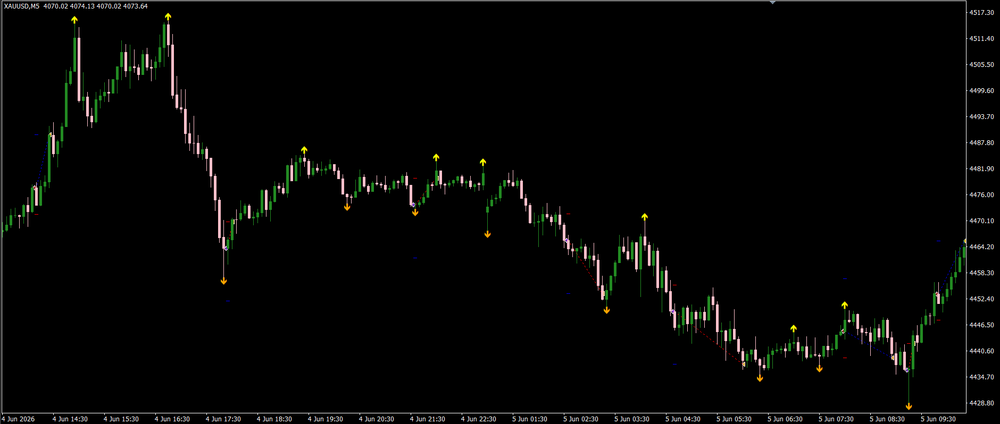
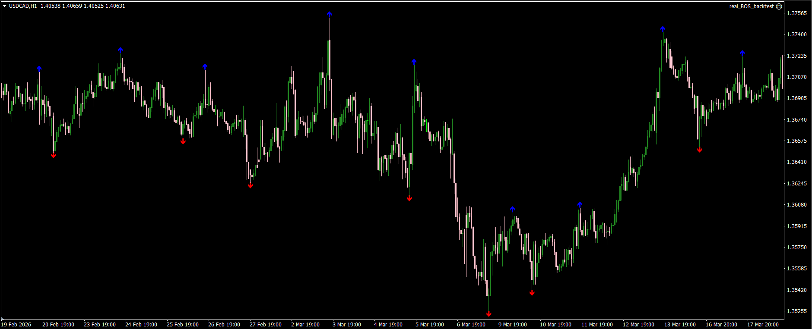

# EA BOS Swing Breakout MT4

## Overview

EA BOS Swing Breakout is an MT4 Expert Advisor based on market structure breakout logic.

The EA identifies confirmed swing high and swing low points, then monitors price action for a Break of Structure (BOS):

- Buy signal: Triggered when the candle closes above the latest detected swing high.
- Sell signal: Triggered when the candle closes below the latest detected swing low.

After a valid breakout, the EA opens a market order with predefined stop loss and take profit levels.

## Features

- Automatic swing high and swing low detection
- Break of Structure (BOS) trading strategy
- Separate swing strength settings for high and low detection
- Automatic buy and sell order execution
- One trade per detected swing level
- Customizable stop loss and take profit
- Swing point visualization with chart arrows
- New candle execution control to prevent repeated signals

## Inputs

| Parameter | Description |
|---|---|
| Hswing_strength | Number of candles used to detect swing highs |
| Lswing_strength | Number of candles used to detect swing lows |
| sl | Stop loss distance in points |
| tp | Take profit distance in points |

## Chart Visualization

The EA automatically marks detected swing points on the chart:

- Blue arrows represent swing highs
- Red arrows represent swing lows

## Screenshot

## Installation

1. Copy the `.mq4` file into: MQL4/Experts/
2. Open MetaEditor and compile the file.
3. Attach the EA to a MetaTrader 4 chart.

## Project Type

Personal MQL4 Development Project

## Author

Leyla Khojasteh

